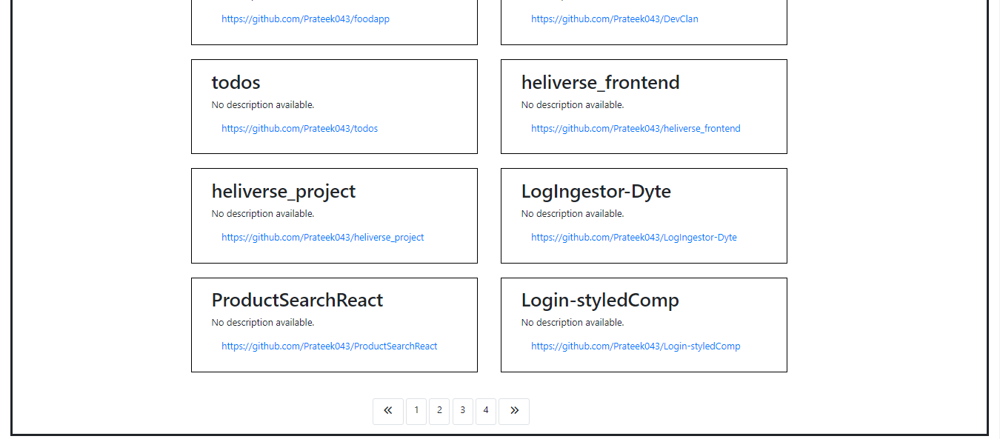

# GitHub User Info Web App

## Overview

This web application is designed to display information about GitHub users, including their avatars, names, addresses, social media links, and repositories. The application features pagination for browsing through multiple user entries and a search functionality to find specific GitHub users.

## Table of Contents

- [Demo](#demo)
- [Features](#features)
- [Installation](#installation)
- [Usage](#usage)
- [Technologies Used](#technologies-used)
- [Screenshots](#Screenshots)

## Demo

Visit the live demo: [GitHub User Info Web App](https://prateek043.github.io/Github-Repo-Search/)

Include a link to a live demo or screenshots to showcase your project. If applicable, provide login credentials for any demo accounts.

## Features

- Display GitHub user information (avatar, name, address, social media links).
- List user repositories with pagination.
- Search functionality to find specific GitHub users.

## Installation

1. Clone the repository:

```bash
git clone https://github.com/Prateek043/Github-Repo-Search.git
cd Github-Repo-Search
```
## Usage
- Open the web application by visiting the live demo link: GitHub User Info Web App.

- Browse through the list of GitHub users displayed on the homepage.

- Use the pagination controls to navigate through multiple pages of user entries.

- To search for a specific GitHub user, use the search bar by entering their username.

- Explore individual user profiles to view detailed information, including avatars, names, addresses, and social media links.

## Technologies Used
- HTML: The structure of the web pages.
- CSS: Styling and layout of the web pages.
- JavaScript: Dynamic functionality, such as fetching and displaying GitHub user data.
- GitHub API: Retrieve user and repository information.
## Screenshots
 
-

